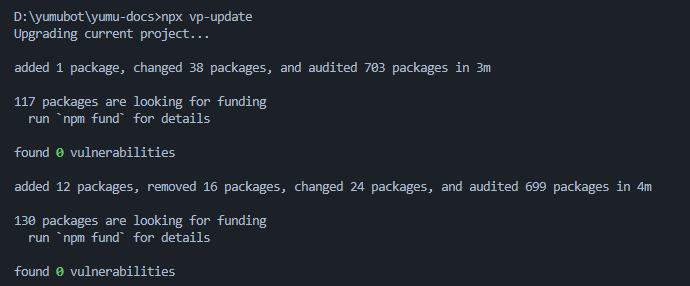

# Yumu Docs 开发说明文档

## 介绍

Yumu Docs 是基于 [VuePress Theme Hope](https://theme-hope.vuejs.press/zh/) 搭建的Yumubot帮助文档静态资源项目。

主题目前处于 beta 阶段，会不定期小版本更新，若开发过程中遇到问题，可以查看 [主题更新日志](https://theme-hope.vuejs.press/zh/changelog.html) 了解详情，或加入 [讨论群](https://jq.qq.com/?_wv=1027&k=rATJyxGK) 咨询开发者。

## 开始

在 [Yumu Docs 仓库首页](https://git.365246692.xyz/bot/yumu-docs) 克隆项目，根据使用的IDE选择对应克隆方式。

本地创建一个空文件夹用于存放项目文件。

## 运行环境

- [nodejs](https://nodejs.org/en/download) 版本 ≥ **22.20.0 LTS** 
推荐安装 LTS 版本的 nodejs，避免最新版本的 nodejs 在开发过程中遇到难以解决的bug。
若本地其他项目需要用到不同版本的 nodejs，可以使用 [nvm](https://nvm.uihtm.com/) 管理 nodejs 版本。

## 启动项目

初次导入项目后，需要下载项目运行的依赖文件，包管理器以npm为例：

```
npm install
or
npm i
```

依赖安装完成后，运行终端输入命令行启动项目。

```
npm run docs:dev
```

## 更新

运行终端输入命令行更新项目全部依赖。

```
npx vp-update
```

更新依赖时无实时进度，请耐心等待，出现如下页面表示更新成功。


