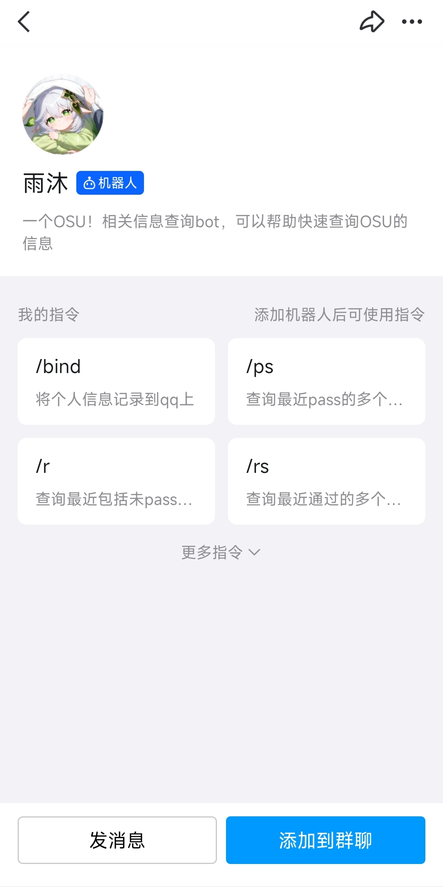

::: warning 注意

Bot 已经正式上线（使用[**腾讯开放的机器人 API**](https://bot.q.qq.com/wiki)，并且有官方账号）。

如果您想要查询之前的部署方法，请参阅：[**部署分身**](./legacy.md)

:::

::: tip 提示

- 使用官方机器人的好处：
    - 开箱即用：无需自己搭建机器人，只需添加即可开始使用。
    - 绑定方便：仅需使用 osu 玩家名绑定。
    - 易于使用：调用指令时，即可看见使用方法。
    - 运行稳定：只要服务器在线，机器人就可用。
- 使用官方机器人的坏处：
    - 更新缓慢：部分新功能不会部署在官方机器人上。
    - 功能受限：部分功能需要更高级别的权限，而官方机器人无法获取这些权限。

由于机器人的主账号加入的群聊太多，容易触及腾讯消息封顶限制，从而导致无法发送消息。因此，如果可以的话，还是推荐您使用官方机器人。

:::

如果您是某群聊的群主或管理员，可以通过手机 QQ 扫描以下二维码添加雨沐 Bot 至您的群聊。

扫描成功后，您可以看见类似以下这样的界面。

点击==添加到群聊==，并选择您管理或拥有的群聊即可完成添加。
