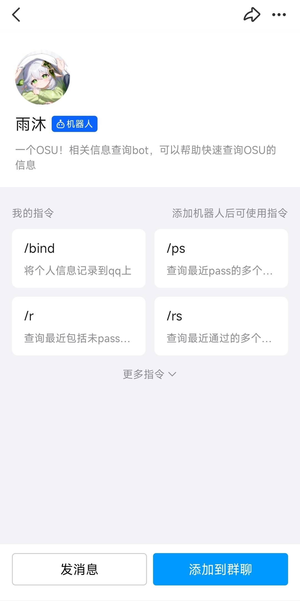

使用[**腾讯开放的机器人 API**](https://bot.q.qq.com/wiki)，并且有官方认证账号的官方机器人，已经正式上线。

<VPCard
title="3889016014"
desc="官方账号 （请邀请我！）"
logo="https://q1.qlogo.cn/g?b=qq&nk=3889016014&s=640"
link="https://qun.qq.com/qunpro/robot/qunshare?robot_appid=102099916&robot_uin=3889016014"
background="rgba(74, 190, 21,0.15)"
/>

:::: info 添加

::: tabs

@tab:active ::qrcode:: 扫描二维码

<button class="link-like" @click="copyToClipboard">{{ copyText }}</button>

支持添加至群聊，也支持私聊。

@tab ::check-double:: 扫描成功

扫描成功后，您可以看见类似以下这样的界面。点击添加到群聊或是发消息即可开始使用。

:::

::::

::: important 特殊提示

请暂时不要给机器人开放所有消息的权限。官方机器人暂时只能认出含有 `@` 的消息。

:::

::: tip 使用官方机器人的优点

- 开箱即用：无需任何门槛，点击完成添加，即可开始使用。
- 绑定方便：输入 /bind 玩家名 即可绑定。
- 提示直观：调用指令（输入斜杠 `/`）时，即可看见指令的提示。
- 运行稳定：只要服务器在线，机器人就可用。

:::

::: warning 使用官方机器人的缺点

- 更新缓慢：部分新功能不会部署在官方机器人上。
- 功能受限：部分功能需要更高级别的权限，而官方机器人无法获取。

:::

