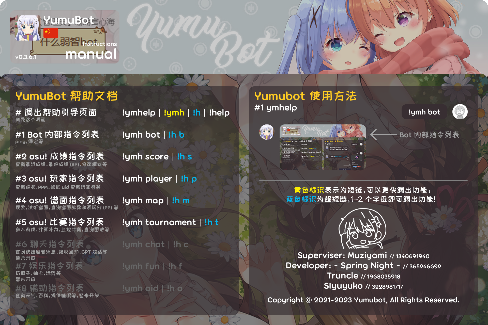
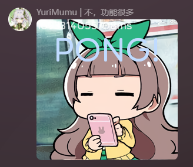
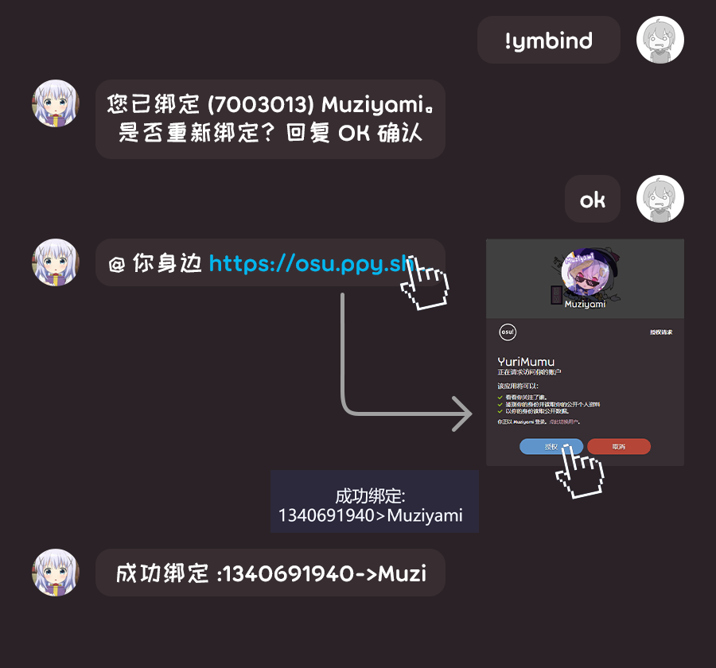

# 内部指令

## <HopeIcon icon="list"/> 1 查询指令列表 !ymhelp (!h)

通过 QQ 群聊，查询机器人基础指令，以及以下所有模块的指令。

**使用方法**

!ymhelp / h (**功能分类**)

- **功能分类**：需要查询的功能类别。可输入：
  - bot / b：内部指令
  - score / s：成绩指令
  - player / p：玩家指令
  - map / m：谱面指令
  - tournament / t：比赛指令
  - chat / c：聊天指令
  - fun / f：娱乐指令
  - aid / a：辅助指令

## <HopeIcon icon="server"/> 2 查询服务状态 !ymping (!pi)

如果Bot在线，则会立即回复一张含 pong! 的图片。

::: tip 提示

有时候，Bot 响应缓慢不一定是 Bot 服务器的问题，也可能是 ppy 服务器炸了。

如果您还是想弄懂问题到底出在哪，可以访问 <HopeIcon icon="link"/> [ppy 服务器状态检测网站](https://status.ppy.sh/)（需要科学上网）。

:::

## <HopeIcon icon="network-wired"/> 3 绑定 osu! 玩家 !ymbind (!bi)

如果用户想要使用 YumuBot 的功能，则必须至少绑定一个 osu! 玩家账号。绑定方法如下。

::: tip 提示

基础绑定方法是 !ymbind，然后点击链接，在==浏览器==登录、授权、从而完成绑定（如上图）。

!ymbind + osuname 也可绑定，但是==无法使用绝大多数功能==。

:::

::: warning 注意

只有管理员可以使用 !unbind / !unbind @User 解绑。如果玩家想解绑，请 <HopeIcon icon="link"/> [==联系开发者==](../about/dev.md)。

:::

## <HopeIcon icon="ban"/> 4 封禁或解封玩家 !ymban (!bq / !bu / !bg)

::: warning 注意

只有管理员可以封禁或解封玩家。

一般来说，YumuBot 是免费，开放且包容的。但如果您==滥用功能、攻击 Bot 及开发者==，那么开发者将有权禁用您使用 Bot 的一切权利。

:::

## <HopeIcon icon="sliders"/> 5 模块开关 !ymswitch (!sw)

::: warning 注意

只有管理员可以使用模块开关。

:::

## ~~<HopeIcon icon="desktop"/> 6 刷屏限制开关 !ymantispam (!as)~~

::: info 备注

暂未开放

或者说，这个功能还没有设计的必要吧？

:::
