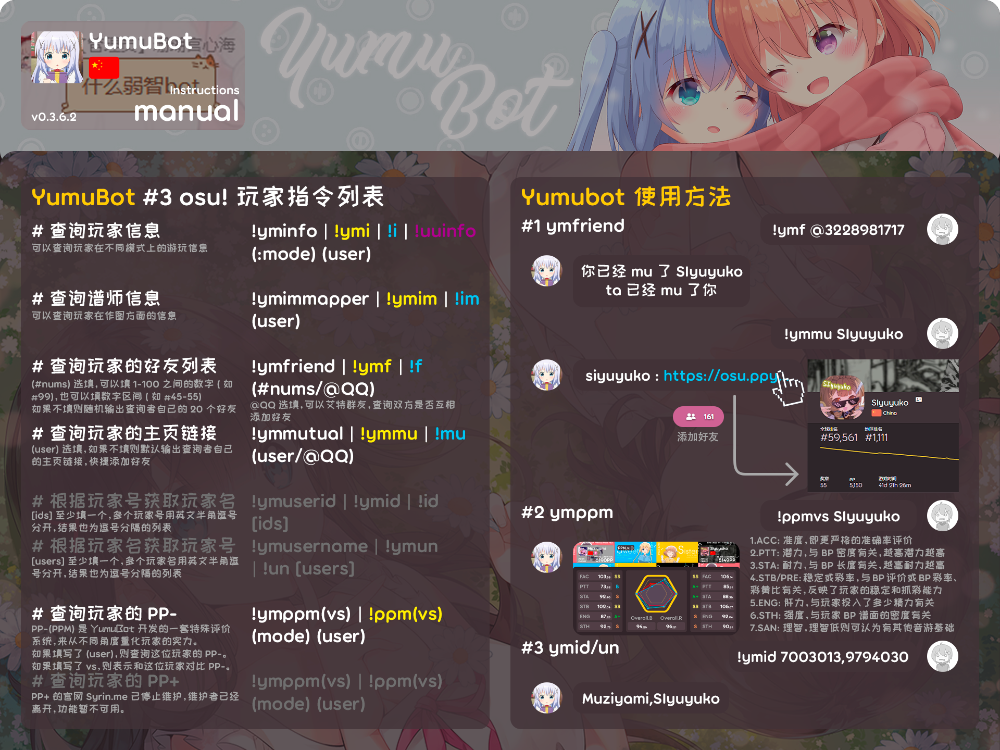
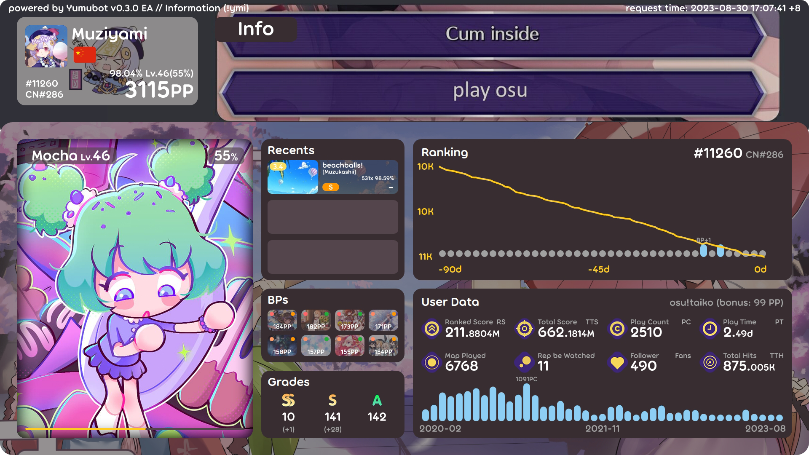
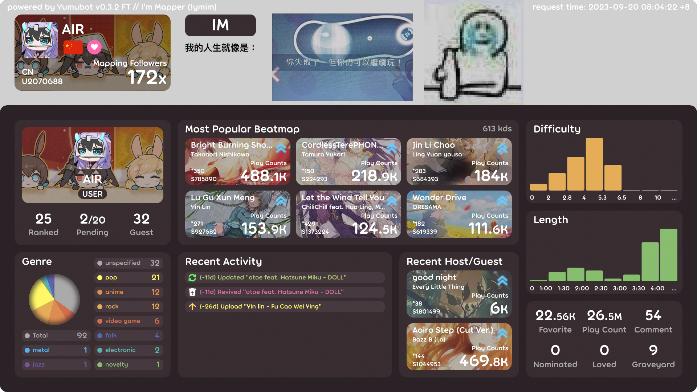
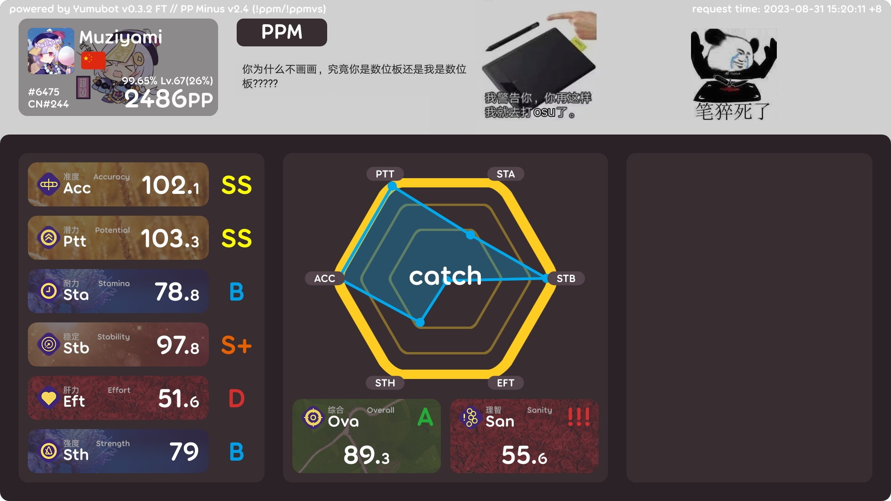

# 玩家指令



## <HopeIcon icon="circle-info"/> 1 查询玩家信息 !yminfo (!i)

可以查询玩家在不同模式上的游玩信息。

**使用方法**

!yminfo / i (**`:`游戏模式**) (**玩家名**)

- **<HopeIcon icon="gamepad"/> 游戏模式**：需要设定的默认游戏模式。请参阅：[游戏模式](./score.md#_1-修改默认游戏模式-ymmode)
- **<HopeIcon icon="address-card"/> 玩家名**：需要查询的玩家名称。暂不支持使用 UID 查询。



**内容解析**

::: details 内容解析

- **Mocha**：玩家所查询的 <HopeIcon icon="gamepad"/> 游戏模式旗下的吉祥物名称。
- **Recents**：玩家的最近三个成绩（包括失败）。
  - 左上角的 <HopeIcon icon="palette"/> 颜色和 <HopeIcon icon="hashtag"/> 数字表示谱面 <HopeIcon icon="star"/> 星数（SR）。
  - 右下角的白色 <HopeIcon icon="font"/> 字符串表示成绩的 <HopeIcon icon="link"/> 连击数和 <HopeIcon icon="bullseye"/> 准确率。
- **BPs**：玩家 BP 榜单上最高八个成绩。
  - 图片左上方的 <HopeIcon icon="circle"/> 圆圈表示 <HopeIcon icon="star"/> 星数（SR）。
  - 图片右上方的 <HopeIcon icon="circle"/> 圆圈表示 <HopeIcon icon="ranking-star"/> 评级（Ranking）。
- **Grades**：玩家总获得 <HopeIcon icon="ranking-star"/> 评级（Ranking）的名称、数量。
  - 下方的灰字指加了 HD、FL、FI <HopeIcon icon="music"/> 模组的成绩。
- **Ranking**：玩家排名情况。
  - 标题右侧是玩家该模式的 <HopeIcon icon="trophy"/> 世界排名，括号里的灰色字是玩家该模式的 <HopeIcon icon="trophy"/> 国家或地区排名。
  - 下方的 <HopeIcon icon="chart-line"/> 折线图反映了九十天内，玩家排名的变化情况。
  - 下方的 <HopeIcon icon="chart-column"/> 条形图反映了玩家 BP 成绩的增加情况。
- **User Data**：玩家统计数据。
  - 从左到右依次是已上架谱面总分、谱面总分、游玩次数、游玩时间，下方是游玩了多少张谱面、回放被他人查看次数、粉丝数、总点击数。
  - 下方的 <HopeIcon icon="chart-column"/> 条形图反映了这段时间内，玩家游玩次数的变化情况。

:::

::: tip 提示

使用 !uui 可以获取文字版消息。

:::

## <HopeIcon icon="compass-drafting"/> 2 查询谱师信息 !ymimmapper (!im)

可以查询玩家 <HopeIcon icon="map"/> 在制作谱面（作图，Beatmapping）方面的信息。

**使用方法**

!ymimmapper / im (**玩家名**)

- **<HopeIcon icon="address-card"/> 玩家名**：同上。



**内容解析**

::: details 内容解析

- **左上角**：玩家的 <HopeIcon icon="circle-user"/> 头像、<HopeIcon icon="heading"/> 名称、玩家所属的 <HopeIcon icon="users"/> 组织。
  - Ranked：玩家制作的 <HopeIcon icon="angles-up"/> 上架谱面数量。
  - Pending：玩家制作的 <HopeIcon icon="circle-question"/> 待定谱面数量和当前玩家待定谱面的 <HopeIcon icon="file-circle-question"/> 总位置（不会多于此值）。
  - Guest：玩家制作的 <HopeIcon icon="user-pen"/> 客串（上架）谱面数量。
- **Most Popular Beatmap**：玩家制作的 <HopeIcon icon="user-check"/> 最受欢迎的前六张谱面。
- **Genre**：玩家制作的谱面内所有关于 <HopeIcon icon="guitar"/> 曲风的 <HopeIcon icon="tag"/> 标签数量。
- **Recent Activity**：玩家 <HopeIcon icon="hourglass"/> 最近在作图内的 <HopeIcon icon="person-walking"/> 活动。
- **Recent Host/Guest**：玩家 <HopeIcon icon="hourglass"/> 最近的上架谱面和 <HopeIcon icon="user-pen"/> 客串（上架）谱面。
- **右下角**：玩家的其他作图 <HopeIcon icon="chart-simple"/> 统计数据。
  - Favorite：谱面所有 <HopeIcon icon="heart-circle-plus"/> 收藏数。
  - Play Count：谱面所有 <HopeIcon icon="circle-play"/> 游玩数。
  - Comment：玩家 <HopeIcon icon="comment"/> 评论数。
  - Nominated：玩家 <HopeIcon icon="thumbs-up"/> 提名谱面的数量。
  - Loved：玩家选入 <HopeIcon icon="heart"/> 社区心选谱面的数量。
  - Graveyard：玩家制作的 <HopeIcon icon="cross"/> 坟场谱面。

:::

::: warning 注意

繁重功能，查询结果将会在 5-10 秒内返回。如果 Bot 消息发送失败，请稍后再重试，切勿刷屏查询。

:::

## <HopeIcon icon="user-group"/> 3 查询玩家的好友列表 !ymfriend (!f)

可以查询玩家所添加（关注）的好友（不能看到双向）。

**使用方法**

!ymfriend / f (**数量或区间**) (**`@`QQ 用户**)

- **<HopeIcon icon="ruler-combined"/> 数量或区间**：可以输入 1-100 内的单个值，也可以输入==差值在 1-100 内==的区间（x-y）。
  - 输入 1，就是随机查询自己的一个好友。
  - 输入 111-120，就是查询自己好友列表内第一百一十一到第一百二十个好友（<HopeIcon icon="arrow-down-a-z"/> 按首字母排列）。
  - 如果 <HopeIcon icon="circle-question"/> 不输入任何值，则默认随机查询二十个好友。
- **<HopeIcon icon="at"/> QQ 用户**
  - 可以查询自己是否和对方互相关注（双向）。

::: warning 注意

繁重功能，查询结果将会在 5-10 秒内返回。如果 Bot 消息发送失败，请稍后再重试，切勿刷屏查询。

:::

## <HopeIcon icon="link"/> 4 查询玩家的主页链接 !ymmutual (!mu)

可以查询玩家所添加（关注）的好友（不能看到双向）。

**使用方法**

!ymmutual / mu (**玩家名**) (**`@`QQ 用户**)

- **<HopeIcon icon="address-card"/> 玩家名**：同上。
- **<HopeIcon icon="at"/> QQ 用户**
  - 可以查询对方的主页链接。

## <HopeIcon icon="chart-simple"/> 5 查询玩家的 PP- !ymppminus (!ppm)

**PP- (PPM)** 是 YumuBot 参考了 [PP+](https://syrin.me/pp+/) 等系统，开发的一套特殊评价系统，来从不同角度量化玩家的实力。

**使用方法**

!ymppminus / ppm (**vs**) (**`:`游戏模式**) (**玩家名**)

- **<HopeIcon icon="crown"/> vs**：如果输入，则返回自己的 PPM 数值与 <HopeIcon icon="address-card"/> 玩家对比图。
- **<HopeIcon icon="gamepad"/> 游戏模式**：同上。请参阅：[游戏模式](./score.md#_1-修改默认游戏模式-ymmode)
- **<HopeIcon icon="address-card"/> 玩家名**：同上。



::: chart PPM

```json
{
  "type": "radar",
  "data": {
    "labels": ["PTT", "STA", "STB", "EFT", "STH", "ACC"],
    "datasets": [
      {
        "label": "我的 PPM 数据",
        "data": [65, 59, 90, 81, 56, 55],
        "fill": true,
        "backgroundColor": "rgba(54, 162, 235, 0.2)",
        "borderColor": "rgb(54, 162, 235)",
        "pointBackgroundColor": "rgb(54, 162, 235)",
        "pointBorderColor": "#fff",
        "pointHoverBackgroundColor": "#fff",
        "pointHoverBorderColor": "rgb(54, 162, 235)"
      },
      {
        "label": "对方的 PPM 数据",
        "data": [28, 48, 40, 19, 96, 27],
        "fill": true,
        "backgroundColor": "rgba(255, 99, 132, 0.2)",
        "borderColor": "rgb(255, 99, 132)",
        "pointBackgroundColor": "rgb(255, 99, 132)",
        "pointBorderColor": "#fff",
        "pointHoverBackgroundColor": "#fff",
        "pointHoverBorderColor": "rgb(255, 99, 132)"
      }
    ]
  },
  "options": {
    "elements": {
      "line": {
        "borderWidth": 3
      }
    }
  }
}
```

:::

**内容解析**

::: details 内容解析

- **ACC**：准度，更严格的 <HopeIcon icon="bullseye"/> 准确率评价。
- **PTT**：潜力，与玩家 BP <HopeIcon icon="arrow-up-right-dots"/> 密度有关。越高，说明 BP 间隙越大，打出好成绩的几率也会越高。
- **STA**：耐力，与玩家 BP <HopeIcon icon="clock"/> 长度有关，越高耐力越高
- **STB**：稳定，与玩家 BP <HopeIcon icon="ranking-star"/> 评级有关。
- **PRE**：彩率，与玩家 BP <HopeIcon icon="barcode"/> 彩率有关。
- **ENG**：肝力，与玩家投入了多少 <HopeIcon icon="person-running"/> 精力（游玩次数）有关。
- **STH**：强度，与玩家 BP 谱面内的 <HopeIcon icon="arrow-up-right-dots"/> 物件密度有关。越高，说明玩家越能应付高密度的谱面。
- **OVA**：综合，一般来说 **90** 以上就是正常、均衡的玩家。
- **SAN**：理智，若 <HopeIcon icon="brain"/> 理智低，则可认为该玩家有其他音游基础，当然也可能是 <HopeIcon icon="triangle-exclamation"/> 小号或 <HopeIcon icon="ban"/> 作弊玩家。
  - SAN 右上角并不是评级，而是另一套指示方法：
  - `+` 越多，越说明玩家的账号可能正常。
  - `-` 越多，越说明玩家的账号可能异常，但仍在可接受范围内。
  - `!` 越多，越说明玩家的账号可能异常。
  - `X` 出现。表示此玩家的账号数据基本不可信。

:::

::: tip 提示

目前 PPM 的版本是 v2.4。而且，PPM 依旧严重依赖玩家的 BP 榜单。在不久的将来，不完全依赖 BP 统计数据，而是偏向于分析成绩的 PPM3 将替代此功能。

使用 !pl / !ppmlegacy 可以输出旧版（v2.2）面板。

:::

## ~~<HopeIcon icon="chart-simple"/> 6 查询玩家的 PP+ !ymppplus (!ppp)~~

::: info 备注

PP+ 的官网 [Syrin.me](https://syrin.me/pp+/) 已停止维护，功能暂不可用。

:::

