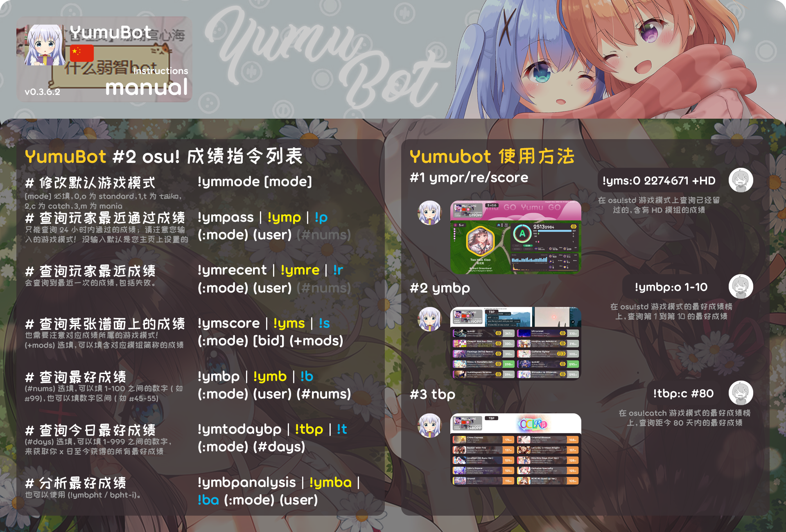
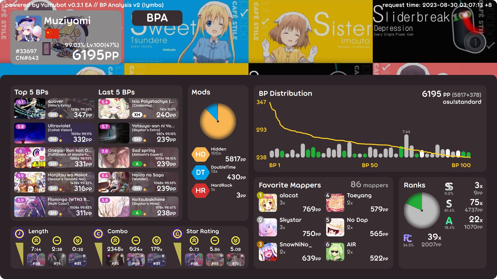

# 成绩指令

## <HopeIcon icon="list"/> 1 修改默认游戏模式 !ymmode

**使用方法**

!ymmode [**游戏模式**]

- **<HopeIcon icon="gamepad"/> 游戏模式**：必填，需要设定的默认 <HopeIcon icon="gamepad"/> 游戏模式。可输入：
  - osu / o / 0：<HopeIcon icon="circle-dot"/> 主模式，osu!standard，osu!std
  - taiko / t / 1：<HopeIcon icon="drum"/> 太鼓模式，osu!taiko
  - catch / fruits / c / 2：<HopeIcon icon="apple-whole"/> 接水果模式，osu!catch
  - mania / m / 3：<HopeIcon icon="keyboard"/> 下落模式，键盘模式，osu!mania

::: warning 注意

强烈建议除了主模式（osu!standard）之外的玩家，在绑定的时候就设定好自己的默认 <HopeIcon icon="gamepad"/> 游戏模式！这能免去很多麻烦。

:::

::: tip 提示

如果事先设定了默认 <HopeIcon icon="gamepad"/> 游戏模式，那么在之后，使用需要输入游戏模式参数的功能的情况下，可以不用通过输入 `:` + <HopeIcon icon="gamepad"/> 游戏模式的方式，来设定游戏模式参数。

同样地，在这里设定的默认 <HopeIcon icon="gamepad"/> 游戏模式，可以与玩家的主页游戏模式，或者玩家在其他 Bot 下设定的默认游戏模式不同。

这在使用多种 Bot 查询成绩的时候尤其有效：比如仅在本 Bot 下查询接水果成绩，在其他 Bot 下查询主模式成绩等。

:::

## <HopeIcon icon="square-check"/> 2 查询玩家最近通过成绩 !ympass (!p)

这个功能只会查询到有效（通过）的成绩。

**使用方法**

!ympass / p (**`:`游戏模式**) (**玩家名**) (**`#`偏移量**)

- **<HopeIcon icon="gamepad"/> 游戏模式**：需要设定的默认游戏模式。请参阅：[<HopeIcon icon="gamepad"/> 游戏模式](#_1-修改默认游戏模式-ymmode)
- **<HopeIcon icon="address-card"/> 玩家名**：需要查询的玩家名称。暂不支持使用 UID 查询。
- **<HopeIcon icon="ruler-horizontal"/> 偏移量**：需要往前偏移几个成绩。输入 1 就是查询最近成绩的前一个成绩。

::: tip 提示

如果默认查询自己的成绩，或是玩家名前后不包含数字，那么偏移量前的 # 号==可以忽略==。

示例：

* !p SIyuyuko #3，合法，查询玩家 SIyuyuko 往前数第三个通过成绩。
* !p SIyuyuko 3，合法，效果同上。
* !p 970 #3，合法，查询玩家 970 往前数第三个通过成绩。
* ==!p 970 3，非法，字段 970 会被匹配到偏移量上。==

大多数带 # 号的参数都有这种性质。请用户注意，在方便输入的同时，也要尽量避免出现非法输入。

:::

## <HopeIcon icon="square-xmark"/> 3 查询玩家最近成绩 !ymrecent (!r)

这个功能可以查询到失败的成绩。

**使用方法**

!ymrecent / r (**`:`游戏模式**) (**玩家名**) (**`#`偏移量**)

- **<HopeIcon icon="gamepad"/> 游戏模式**：同上。请参阅：[<HopeIcon icon="gamepad"/> 游戏模式](#_1-修改默认游戏模式-ymmode)
- **<HopeIcon icon="address-card"/> 玩家名**：同上。
- **<HopeIcon icon="ruler-horizontal"/> 偏移量**：同上。

## <HopeIcon icon="square-xmark"/> 4 查询某张谱面上的成绩 !ymscore (!s)

这个功能可以查询到上榜（谱面已上架，且玩家游玩过）的成绩。

**使用方法**

!ymscore / s (**`:`游戏模式**) [**谱面编号**] (**`+`模组名称**)

- **<HopeIcon icon="gamepad"/> 游戏模式**：同上。请参阅：[<HopeIcon icon="gamepad"/> 游戏模式](#_1-修改默认游戏模式-ymmode)
- **<HopeIcon icon="hashtag"/> 谱面编号**：必填，需要查询的谱面编号 (BID)。
- **<HopeIcon icon="music"/> 模组名称**：<HopeIcon icon="music"/> 模组的简称，通常为两位大写字母组成。可以无空格地输入多个 <HopeIcon icon="music"/> 模组。

::: details 可输入的 <HopeIcon icon="music"/> 模组名称

EZ、NF、HT、HR、SD、PF、DT、NC、HD、FI、FL、MR

:::

::: info 备注

暂时不能查询其他玩家在某张谱面上的成绩。

:::

## <HopeIcon icon="angles-up"/> 5 查询玩家最好成绩 !ymbestperformance (!b)

这个功能可以查询到玩家最好成绩榜（BP）上的成绩。

**使用方法**

!ymbp / b (**`:`游戏模式**) (**玩家名**) (**`#`偏移量或区间**)

- **<HopeIcon icon="gamepad"/> 游戏模式**：同上。请参阅：[<HopeIcon icon="gamepad"/> 游戏模式](#_1-修改默认游戏模式-ymmode)
- **<HopeIcon icon="address-card"/> 玩家名**：同上。
- **<HopeIcon icon="ruler-horizontal"/> 偏移量或区间**：可以输入 1-100 内的单个值，也可以输入 1-100 内的区间（x-y）。
  - 输入 1，就是查询榜上的第一个成绩。
  - 输入 1-10，就是查询榜上的第一到第十个成绩。

::: tip 提示

如果默认查询自己的成绩，或是玩家名前后不包含数字，那么偏移量或区间前的 # 号==可以忽略==。

:::

## <HopeIcon icon="angles-up"/> 6 查询今日最好成绩 !ymtodaybp (!t)

这个功能可以查询到玩家今天（或直到距今天多少天前）最好成绩榜（BP）上新增的成绩。

**使用方法**

!ymtbp / t (**`:`游戏模式**) (**`#`天数**)

- **<HopeIcon icon="gamepad"/> 游戏模式**：同上。请参阅：[<HopeIcon icon="gamepad"/> 游戏模式](#_1-修改默认游戏模式-ymmode)
- **<HopeIcon icon="calendar-days"/> 天数**：可以输入 1-999 内的值。
  - 输入 30 就是查询距今 30 天内，玩家最好成绩榜上新增的成绩。

::: tip 提示

天数前的 # 号==可以忽略==。

:::

::: info 备注

暂时不能查询其他玩家新增的成绩。

:::

## <HopeIcon icon="chart-pie"/> 7 分析最好成绩 !ymbpanalysis (!ba)

这个功能可以分析玩家的最好成绩榜，从而判断玩家目前的状态，以及玩家的偏好或技巧。

**使用方法**

!ymbpa / ba (**`:`游戏模式**) (**玩家名**)

- **<HopeIcon icon="gamepad"/> 游戏模式**：同上。请参阅：[<HopeIcon icon="gamepad"/> 游戏模式](#_1-修改默认游戏模式-ymmode)
- **<HopeIcon icon="address-card"/> 玩家名**：同上。

**内容解析**

::: details 内容解析

- **Top 5 BPs**：玩家 BP 前五位。
- **Last 5 BPs**：玩家 BP 末五位。
- **Mods**：玩家 BP 内 <HopeIcon icon="music"/> 模组的分布情况。
  - 靠中间的 <HopeIcon icon="chart-pie"/> 饼图下方依次是各个 <HopeIcon icon="music"/> 模组的名称、数量（灰色字）以及所占 PP（加权后）。这个 PP 越高，说明玩家在这个 <HopeIcon icon="music"/> 模组上越熟练。
- **BP Distribution**：BP 分布情况。
  - 标题右侧是玩家的该模式总 PP，括号里的灰色字是谱面 PP + <HopeIcon icon="sack-dollar"/> 奖励 PP（Bonus PP）。灰色字下方是该 <HopeIcon icon="gamepad"/> 游戏模式。
  - 下方的 <HopeIcon icon="chart-line"/> 折线图反映了玩家 BP 成绩的 PP 分布。
  - 下方的 <HopeIcon icon="chart-column"/> 条形图反映了玩家 BP 成绩的 <HopeIcon icon="clock"/> 时长（高度）以及 <HopeIcon icon="ranking-star"/> 评级（颜色）分布。
- **Length、Combo、Star Rating**：分析玩家 BP 内 <HopeIcon icon="clock"/> 时长、<HopeIcon icon="link"/> 连击数、<HopeIcon icon="star"/> 星数的分布情况。
  - 带有 <HopeIcon icon="angles-up"/> 图标的指对应值的最大值。相应地，<HopeIcon icon="angles-down"/> 指最小值， <HopeIcon icon="minus"/> 指中位数（不是平均数！）。
  - 每个图标最下面的 <HopeIcon icon="image"/> 图片即代表了对应的成绩。
  - 图片左上方的 <HopeIcon icon="circle"/> 圆圈表示 <HopeIcon icon="star"/> 星数（SR）。
  - 图片右上方的 <HopeIcon icon="circle"/> 圆圈表示 <HopeIcon icon="ranking-star"/> 评级（Ranking）。
  - **Favorite Mappers**：最喜爱的谱师分布情况。
    - 标题右侧指明了玩家的榜单上，不同的谱师数量。
    - 谱师名称下方依次是各个谱师所制作的谱面的成绩数量，以及所占 PP（加权后）。这个 PP 越高，说明玩家越能刷这个谱师制作的谱面。
- **Ranks**：玩家 BP 内 <HopeIcon icon="ranking-star"/> 评级（Ranking）的名称、数量以及所占 PP（加权后，灰字）。

:::

::: tip 提示

这个功能还有个文字版本，可以通过输入 !ymbpht / !ymbpht-i 调出。

并且，据说输入某个老师和学生深入交流的游戏英文名，也可以调出此功能哦？

:::
