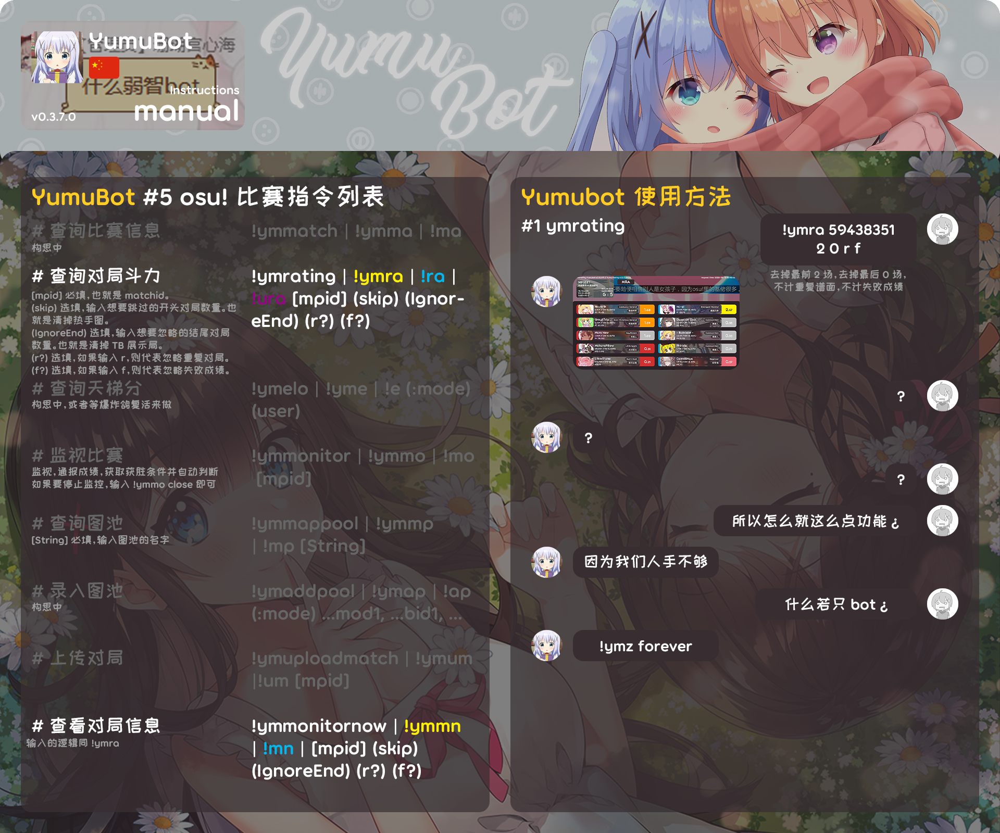
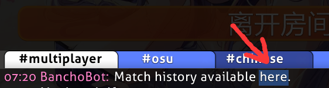
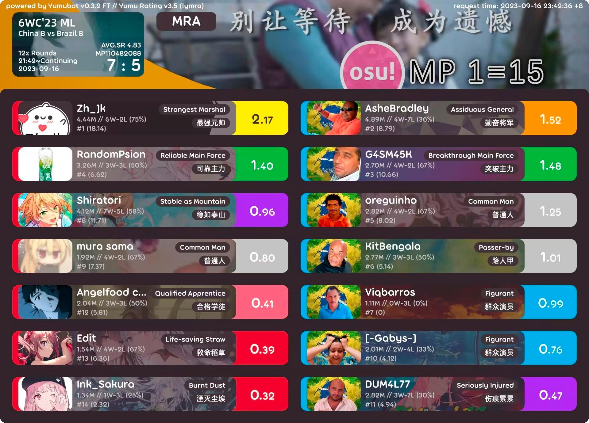

# 比赛指令

## ~~<HopeIcon icon="house-chimney-user"/> 1 查询比赛信息 !ymmatch (!ma)~~

::: info 备注

暂未开放

:::

## <HopeIcon icon="scale-balanced"/> 2 查询比赛斗力（评分） !ymrating (!ra)

通过分析比赛所有对局，来给玩家赋予一个斗力（表现评分）。

**使用方法**

!ymrating / ra [**比赛编号**] (**跳过开头**) (**忽略结尾**) (**f**) (**r**)

- **<HopeIcon icon="hashtag"/> 比赛编号**：必填，需要查询的比赛编号 (MATCHID)。
  - 获取方法：进入房间，点击 #multiplayer 下，BanchoBot 发送的第一条消息中的蓝色 here。之后，在弹出的网站内找到网站链接末尾的数字，即比赛编号 (MATCHID)。

- **<HopeIcon icon="forward"/> 跳过开头**：需要跳过的开头对局数量。这适用于比赛含有**热手**等不需要统计玩家表现的开头对局。
    - 如不填写，默认为 0。想要输入后侧的参数时，也可输入 0 来占位。
- **<HopeIcon icon="rotate-left"/> 忽略结尾**：需要忽略的结尾对局数量。这适用于比赛含有 **TB 表演对局**等不需要统计玩家表现的结尾对局。
    - 如不填写，默认为 0。
- **<HopeIcon icon="person-falling"/> f**：如果填入 f，则表示忽略玩家的失败成绩。
    - 如不填写，默认统计玩家的失败成绩。
- **<HopeIcon icon="slash"/> r**：如果填入 r，则表示忽略重复的对局，只保留靠后的那一场。
    - 如不填写，默认统计重复的对局。

**内容解析**

::: details 内容解析

- **左上角的比赛信息卡片**：
  - 卡片左上角是比赛的 <HopeIcon icon="heading"/> 房间标题。
  - 卡片左下角依次是 <HopeIcon icon="hashtag"/> 对局数量、<HopeIcon icon="clock"/> 比赛时间区间以及 <HopeIcon icon="calendar"/> 比赛日期。
  - 卡片右下角依次是比赛 <HopeIcon icon="star"/> 平均星数、<HopeIcon icon="hashtag"/> 比赛编号以及 <HopeIcon icon="clipboard"/> 计分板。
- **玩家个人信息卡片**：
  - 卡片左侧是玩家的 <HopeIcon icon="palette"/> 队伍颜色和 <HopeIcon icon="circle-user"/> 头像。
  - 卡片中间靠左依次是玩家的 <HopeIcon icon="heading"/> 昵称、<HopeIcon icon="person-rays"/> 比赛总分（总输出）、<HopeIcon icon="chess-king"/> 胜负和胜率、<HopeIcon icon="user-plus"/> 玩家评分排名和 <HopeIcon icon="wave-square"/> RWS。
    - RWS 指 <HopeIcon icon="wave-square"/> 平均胜利分配，即为了所属队伍的**胜利**做出了多少贡献。有时候玩家评分很高，但不一定很有用。
  - 卡片中间靠右是 <HopeIcon icon="tags"/> 玩家类型和 <HopeIcon icon="sun"/> 玩家评分。
    - 玩家类型：Yumu Rating v1.2 推出的新功能，旨在更加细化地去区分玩家在比赛中所扮演的角色。目前已有 11 种大类，每种大类还有 3 种小类。
    - 玩家评分：只需要记住：==平均分是 **1** 分，毫无参与感的玩家是 **0** 分。==

| 输出/评分 | 高 | 中 | 低 |
|:-:|:-:|:-:|:-:|
| 高 | ⬤ 大哥 | ⬤ 打工 | ⬤ 抗压 |
| 中 | ⬤ 主力 | ⬤ 普通 | ⬤ 背锅 |
| 低 | ⬤ 专精 | ⬤ 客串 | ⬤ 小弟 |

输出很高、评分很高的大哥即 ⬤ 大爹，输出很低、评分很低的小弟即 ⬤ 炮灰。

| 玩家类型/RWS | 贡献高 | 贡献中 | 贡献低 |
|:-:|:-:|:-:|:-:|
| ⬤ 大爹 | 最强元帅 | 称职元帅 | 不屈元帅 |
| ⬤ 大哥 | 常胜将军 | 勤奋将军 | 尽力将军 |
| ⬤ 主力 | 突破主力 | 可靠主力 | 坚守主力 |
| ⬤ 专精 | 精锐刺客 | 普通刺客 | 冒牌刺客 |
| ⬤ 打工 | 金领工人 | 白领工人 | 蓝领工人 |
| ⬤ 普通 | 关键人 | 普通人 | 路人甲 |
| ⬤ 客串 | 主要角色 | 次要角色 | 群众演员 |
| ⬤ 抗压 | 稳如泰山 | 坚若磐石 | 伤痕累累 |
| ⬤ 背锅 | 上等忍者 | 普通忍者 | 不入流 |
| ⬤ 小弟 | 幸运儿 | 合格学徒 | 初学者 |
| ⬤ 炮灰 | 救命稻草 | 点点星火 | 湮灭尘埃 |

:::

::: tip 提示

使用 !ral / !ralegacy 可以输出旧版（v3.4）面板。

:::

## <HopeIcon icon="house-chimney-user"/> 3 查看比赛房间信息 !ymmonitornow (!mn)

输出一张比赛房间内的情况图。

**使用方法**

!ymmonitornow / mn [**比赛编号**] (**跳过开头**) (**忽略结尾**) (**f**) (**r**)

- **<HopeIcon icon="hashtag"/> 比赛编号**：同上。
- **<HopeIcon icon="forward"/> 跳过开头**：同上。
- **<HopeIcon icon="rotate-left"/> 忽略结尾**：同上。
- **<HopeIcon icon="person-falling"/> f**：如果填入 f，则表示忽略玩家的失败成绩。
  - 如不填写，默认统计玩家的失败成绩。
- **<HopeIcon icon="slash"/> r**：如果填入 r，则表示忽略重复的对局，只保留靠后的那一场。
  - 如不填写，默认统计重复的对局。

::: tip 提示

此功能的参数和 ra 完全一致。记住一个即可。

:::

